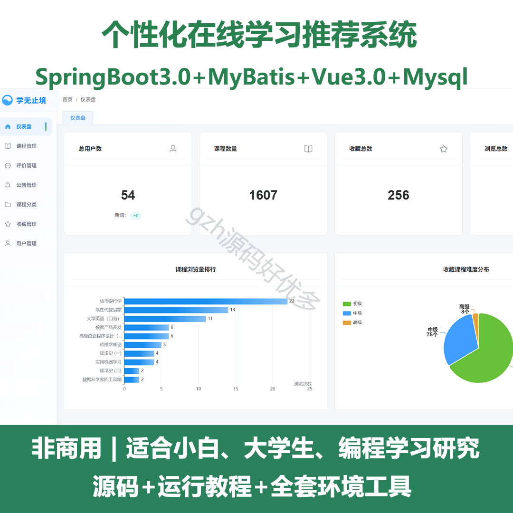
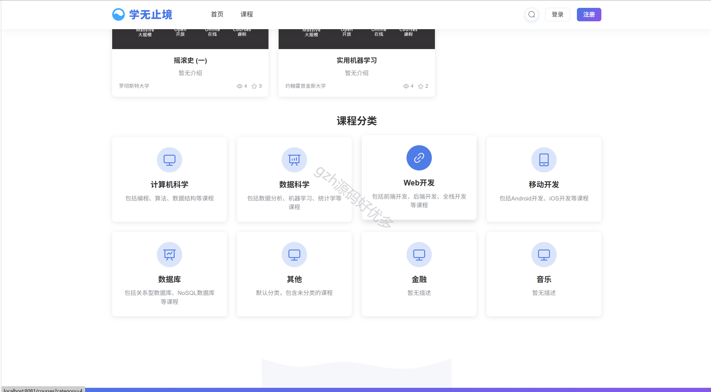
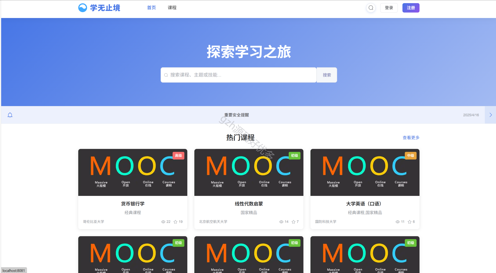
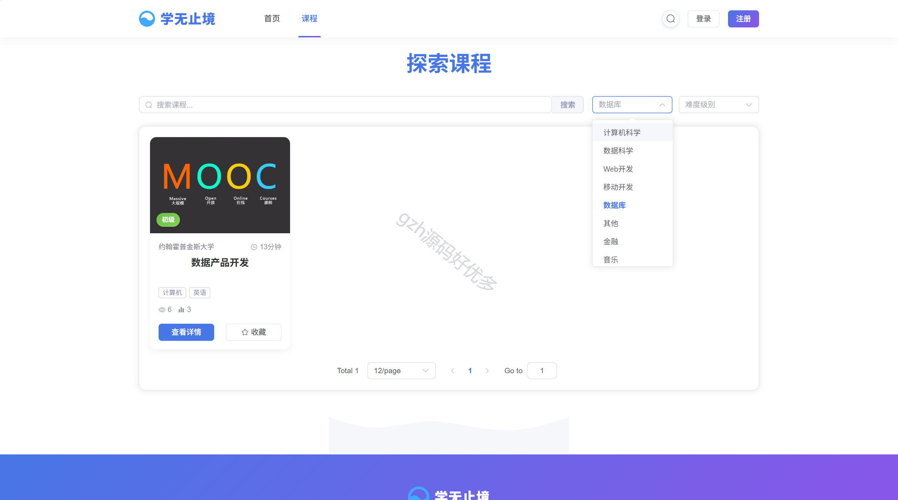
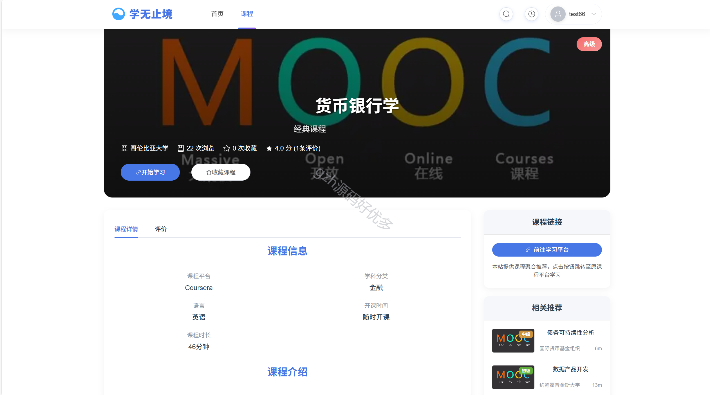
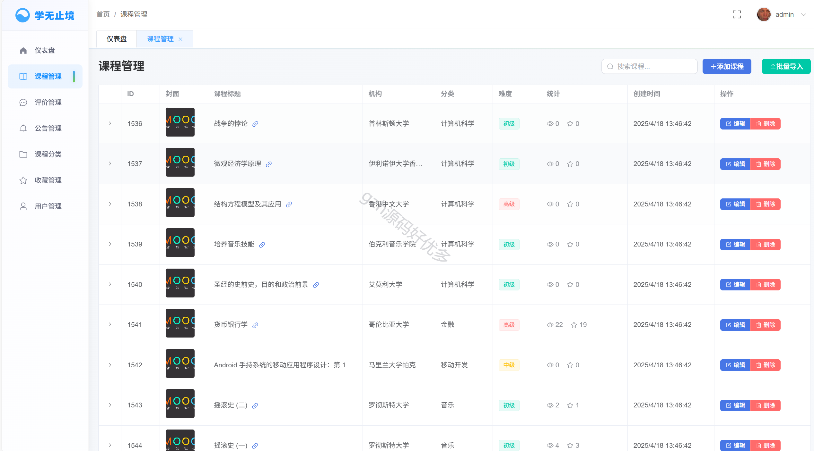
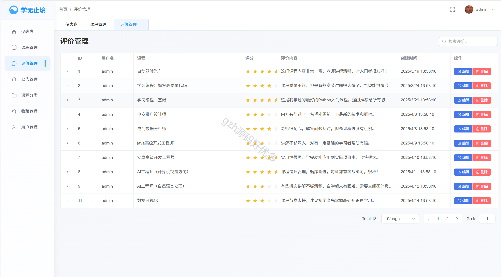
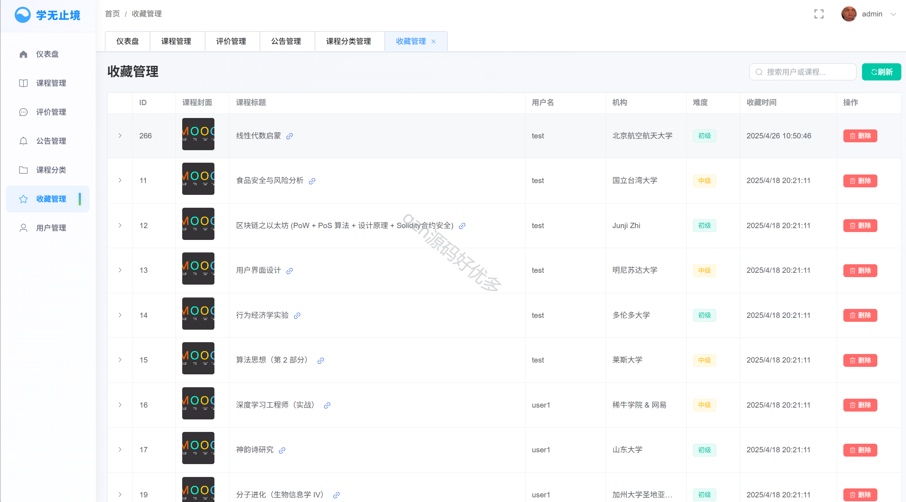
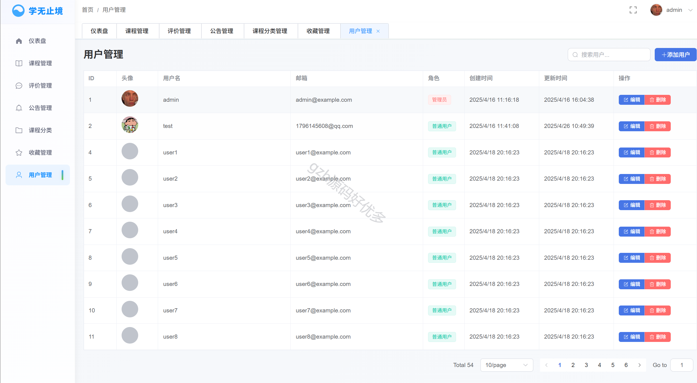

# springbootA530
springbootA530个性化在线学习推荐系统（Vue3）
 
## 查看主页获取源码

### 一、关键词
个性化学习推荐系统，个性化学习系统

### 二、作品包含
源码+数据库+全套环境和工具资源+本地部署教程

### 三、项目技术
前端技术：Html、Css、Js、Vue3.0、Element-plus
后端技术：Java、SpringBoot3.0、MyBatis

### 四、运行环境（以下版本亲测，其他版本兼容性请自行测试）
开发工具：IDEA/eclipse  + VSCODE

数据库：MySQL8

数据库管理工具：Navicat10以上版本

环境配置软件： JDK17 + Maven3.6.3

前端Nodejs：16

浏览器：谷歌浏览器

### 五、项目介绍
项目编号：springbootA530

本系统是一个基于SpringBoot+Vue的在线学习推荐平台，为用户提供课程浏览、收藏、评价等功能，并基于协同过滤算法提供个性化课程推荐。

2. 角色划分
系统包含以下角色：
游客
浏览课程
查看热门课程
搜索课程
注册账号
普通用户
登录/注销
修改个人信息
收藏/取消收藏课程
评价课程
查看个性化推荐课程
查看已收藏课程
开始学习课程
管理员
用户管理
课程管理
课程分类管理
评价管理
查看数据分析
发布公告
3. 功能模块划分
3.1 用户模块
用户注册
用户登录
个人信息管理
密码修改
3.2 课程模块
课程列表展示
课程搜索
课程详情
课程收藏
课程评价
开始学习（跳转）
3.3 推荐模块
热门课程推荐
基于协同过滤的个性化推荐
基于用户浏览历史的实时推荐
冷启动处理（热门课程推荐）
3.4 管理模块
用户管理 CRUD
课程管理 CRUD
课程分类管理 CRUD
评价管理
公告管理
3.5 数据分析模块
用户活跃度分析
课程热度分析
评价统计分析
### 六、运行截图

